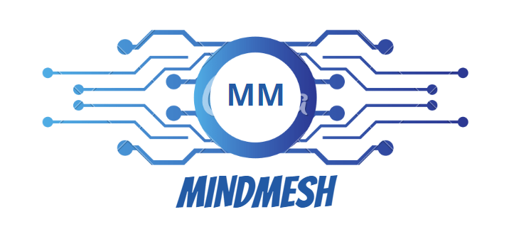
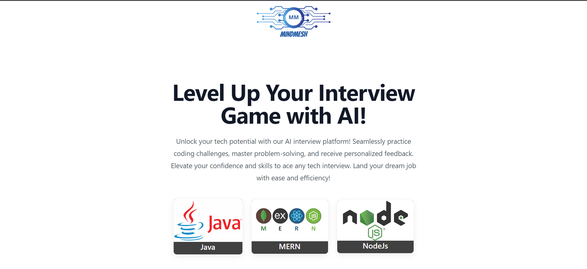
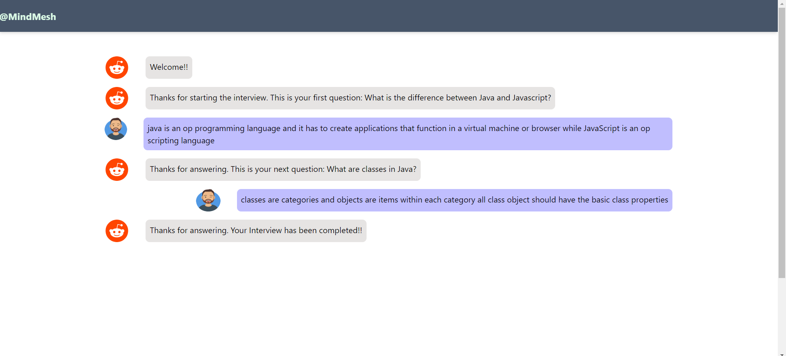

# MindMesh

MindMesh is a collaborative web application designed to help users practice mock interviews using cutting-edge AI technology. It integrates the power of OpenAI's GPT-3.5 Turbo model for providing a seamless and interactive experience.

## Features

- Conduct mock interviews with AI-powered interviewer
- Interactive and dynamic conversation with GPT-3.5 Turbo
- Real-time feedback and performance evaluation
- Extensive library of interview questions
- User-friendly interface for a seamless experience

## Tech Stack

The Intezy project utilizes the following technologies:

- Frontend: React.js ,Typescript , Tailwind CSS
- Backend: Java Spring Boot
- AI Model: GPT-3.5 Turbo by OpenAI

## Collaborators

MindMesh is the result of the collaborative efforts of the following team members:

- Sheik Mohamed Dashleem - Backend Developer
- Sumit Kumar - Backend Developer
- Chandrakala Masiwal - Frontend Developer (Home Page And Chat Page)
- Pashupatinath Singh - Frontend Developer (Result Page)

## Installation

To run Intezy locally, follow these steps:

1. Clone the repository from GitHub: `git clone `https://github.com/sheikmohameddashleem/MindMesh.git`
2. Install frontend dependencies: `cd frontend && npm install`
3. Install backend dependencies: `cd backend && mvn install`

## Usage

To start the application, follow these steps:

1. Run the frontend server: `cd frontend && npm start`
2. Run the backend server: `cd backend && mvn spring-boot:run`

## Website UI

### LandingPage

### Chat Page

### Score Card Page
